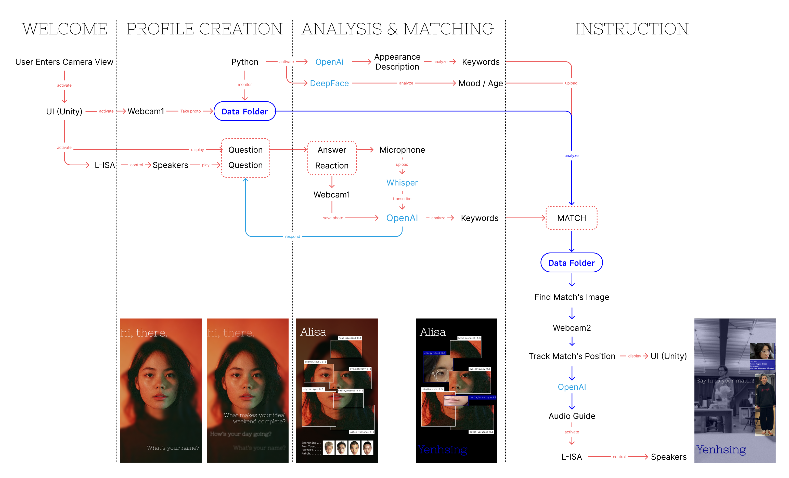
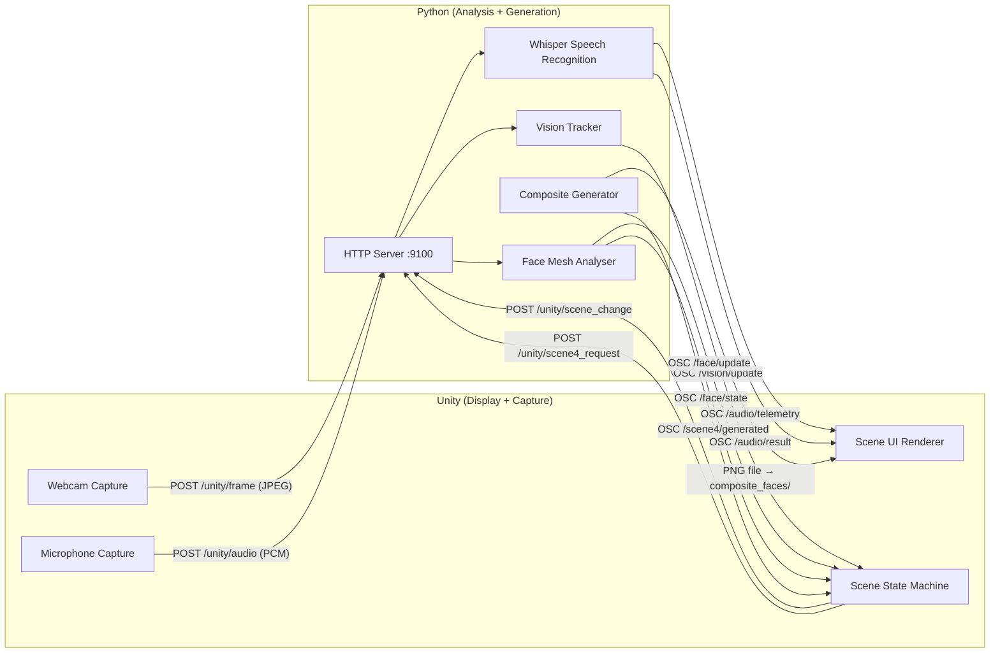
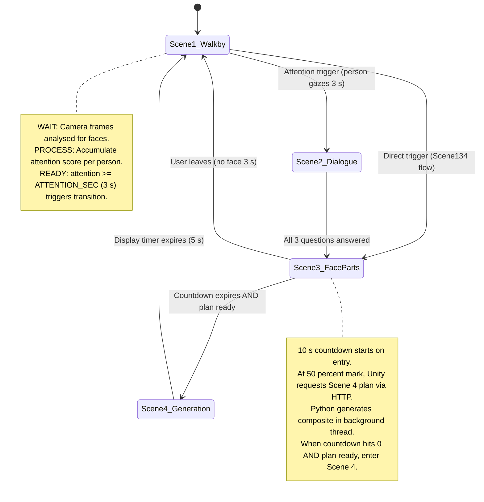

# HiYou — An AI Icebreaker for Real-World Connections

HiYou is an interactive AI system that analyzes real-time human presence, attention, facial expressions, and conversational responses to create personalized social connections. By combining computer vision, speech recognition, and AI-driven user matching, the system identifies compatible participants from the event database and generates an immersive interaction experience.

## Workflow



## Features

### 1. Real-Time Person Detection & Attention Tracking

The system uses live camera input to detect and track visitors in the environment.  
By analyzing gaze duration and engagement time, it estimates user attention levels and triggers the interactive experience when a participant maintains focus on the screen for more than 3 seconds.

### 2. Voice-Based Conversational Interaction (Optional)

The system provides pre-recorded questions (Q1–Q3) and captures user responses through speech recognition.

Using OpenAI Whisper, the system converts voice input into text and analyzes conversational responses as part of the user profile generation process.

### 3. Real-Time Facial Feature Analysis

While users interact with the system, MediaPipe Face Mesh tracks 468 facial landmarks to extract behavioral and emotional features in real time.

The system analyzes six key interaction indicators:

- Head movement
- Energy level
- Eye activity
- Rhythm synchronization
- Smile intensity
- Pitch variation

These features are used to understand user expression patterns and communication style.

### 4. AI-Based Social Matching

After collecting interaction data, the system compares the current user's:

- Conversational responses
- Facial behavior patterns
- Interaction style
- Visual appearance / clothing style

with the existing participant database collected during the event.

Based on these multimodal features, the system identifies the most compatible person for a potential conversation.

### 5. Composite Portrait Generation & Spatial Guidance

After matching, the system generates a personalized Composite Portrait combining the user and their matched participant.

The system then searches the physical environment, locates the matched person, and provides real-time spatial guidance to direct the user toward their recommended connection.

## Technology Stack

- Computer Vision
  - MediaPipe Face Mesh
  - Real-time facial landmark tracking
  - Person detection & tracking

- Speech Processing
  - OpenAI Whisper
  - Voice-to-text analysis

- AI Interaction
  - Multimodal feature extraction
  - User similarity matching
  - Generative portrait synthesis

- Data Processing
  - Real-time user profile generation
  - Event-based participant database matching

---

# Hi!you — Interactive Walk-by Portrait Installation

**Hi!you** is a real-time interactive art installation that detects passersby via a live camera feed, engages them in a short spoken dialogue, analyses their facial expressions, and generates a personalised composite portrait — all within seconds. It is built as a **two-peer, event-driven, bidirectional feedback loop** between a Unity front-end (display + capture) and a Python back-end (computer vision + speech recognition + image generation).

---

## Architecture (High-Level)

The system is split into two cooperating processes running on the same machine:

| Peer | Role |
|------|------|
| **Unity** (C# / UI Toolkit) | Captures webcam frames & microphone audio, renders the multi-scene UI, drives the scene state machine |
| **Python** (Flask + MediaPipe + Whisper) | Receives frames over HTTP, runs vision / face-mesh / speech pipelines, pushes results back via OSC |

Communication is **bidirectional**:

* **Unity → Python**: HTTP POST (frames, audio chunks, scene-change commands, Scene 4 plan requests)
* **Python → Unity**: OSC/UDP messages (vision data, face metrics, state events, audio telemetry, composite-ready notification)
* **Python → Unity (file)**: Scene 4 composite PNG written to a shared folder, polled by Unity

> **Note on transport vs. system semantics:**  Each individual HTTP request or OSC message is a one-way, fire-and-forget transmission. The *bidirectional* quality emerges at the system level: Unity sends a frame, Python analyses it and pushes results back via OSC, Unity updates its state machine and may issue a new HTTP command in response. This continuous publish → analyse → react cycle forms a **control-negotiation loop** — neither peer is purely a client or purely a server.



---

## State / Scene Flow

The installation cycles through four scenes. Scene 2 (Dialogue) is optional and can be skipped in the simplified `Scene134Manager` flow.



### Scene Descriptions

| Scene | Purpose | Key Logic |
|-------|---------|-----------|
| **Scene 1 — Walk-by** | Detect and track passersby. Show face boxes and attention meters on the live feed. | `vision_tracker.py` runs MediaPipe Face Detection + Pose, assigns stable IDs, accumulates per-person attention, and fires a trigger when threshold is reached. |
| **Scene 2 — Dialogue** | Play three pre-recorded questions (Q1–Q3 audio clips) and capture the visitor's spoken answers via Whisper. | `ChatSystem.cs` plays audio, polls `GET /unity/speech_state` for recognised text. `AudioWorker` detects utterance boundaries from RMS energy and runs Whisper. |
| **Scene 3 — Face Parts** | Detailed facial-feature analysis. Six metric boxes (head movement, energy, eye activity, rhythm sync, smile intensity, pitch variance) rendered over a blurred webcam background. | `faceProcessor_v2.py` uses MediaPipe Face Mesh (468 landmarks) to compute real-time metrics. `DrawFacialBoxes.cs` renders boxes and clear-image overlays. Darkness increases as countdown progresses. |
| **Scene 4 — Generation** | Show the generated composite portrait. | `face_composer.py` zooms and re-frames the visitor's face, creates a 1080×1920 composite, saves it as PNG. `CompositedFace.cs` polls the output folder and displays the latest image. |

---

## Repository Layout

```
Hi!you/
├── Assets/
│   ├── Scenes/MainInterface.unity          # Single Unity scene
│   ├── Scripts/Editor/PythonLauncherEditor.cs
│   ├── Shaders/                            # Blur & frosted-glass shaders
│   ├── Fonts/, Settings/, UI Toolkit/      # URP settings, UXML layouts, USS styles
│   └── UI Toolkit/UI Assets/Webcam/
│       ├── scripts/                        # All runtime C# scripts (see below)
│       └── composite_faces/               # Scene 4 output folder (file handoff)
├── PythonProject/
│   ├── corePipeline_v4.py                  # Python entry point (Flask + workers)
│   ├── http_handlers/                      # Flask route handlers
│   ├── processors/                         # Vision, face mesh, audio, Whisper, face saver
│   ├── workers/                            # AudioWorker, FaceComposer
│   ├── utils/                              # Config, state, queues, speech state
│   ├── models/arcface.onnx                 # ArcFace embedding model (identity matching)
│   └── faces/                              # Saved face snapshots (per session)
├── Packages/
│   └── jp.keijiro.osc-jack/                # OSC library for Unity (local package)
├── YenhsingDeyingAudio/                    # Reaper project + dialogue WAV assets
├── ProjectSettings/                        # Unity project settings
└── builtUIII/                              # Built player output
```

### Key C# Scripts

| Script | Role |
|--------|------|
| `SceneFlowManager.cs` | Full four-scene state machine (Scene 1→2→3→4→1) |
| `Scene134Manager.cs` | Simplified three-scene flow (Scene 1→3→4→1, skips dialogue) |
| `PythonEventRouter.cs` | OSC server (port 8992), deserialises all Python messages, dispatches C# events on main thread |
| `ImageSender_v2.cs` | Captures webcam frames, POST-encodes as JPEG, sends to Python at ~10 FPS |
| `AudioSender.cs` | Streams microphone PCM chunks to Python via HTTP |
| `SceneChangeSender.cs` | POST scene-change and Scene 4 plan requests to Python |
| `ChatSystem.cs` | Scene 2 dialogue controller — plays Q1/Q2/Q3 audio, polls speech state, fires `OnDialogueComplete` |
| `ScanningRoom.cs` | Scene 1 UI — renders face boxes, attention bars, clothing labels |
| `DrawFacialBoxes.cs` | Scene 3 UI — renders six metric boxes with clear-image overlays and blur shader |
| `CompositedFace.cs` | Scene 4 UI — polls `composite_faces/` folder for latest PNG |
| `WebCamController_v2.cs` | Webcam initialisation, frame rotation, scale-and-crop to 1080×1920 |
| `MicrophoneController.cs` | Singleton microphone capture at 16 kHz / 44.1 kHz |
| `PythonLauncher.cs` | Optionally auto-launches the Python process from Unity |

### Key Python Modules

| Module | Role |
|--------|------|
| `corePipeline_v4.py` | Entry point — Flask app, worker threads, microphone stream, OSC client |
| `vision_tracker.py` | Scene 1 — MediaPipe face detection + pose, stable ID assignment, attention accumulation, face saving |
| `faceProcessor_v2.py` | Scene 3 — MediaPipe Face Mesh, six facial metrics, bounding-box computation |
| `face_composer.py` | Scene 4 — detect-and-zoom face, compose 1080×1920 canvas, encode as PNG |
| `audio_worker.py` | Adaptive noise-floor, utterance boundary detection, Whisper dispatch |
| `whisper_agent.py` | OpenAI Whisper STT wrapper (model configurable, default `small`) |
| `audioProcessor.py` | PCM byte → numpy float32 conversion |
| `face_saver.py` | Saves one snapshot per unique person (front-facing, stable for 2+ s) |
| `identity_manager.py` | ArcFace cosine-similarity identity matching (stub / prototype) |

---

## Communication Contracts

### HTTP Endpoints (Unity → Python)

All endpoints are served by Flask on **port 9100**. Unity scripts connect to `http://127.0.0.1:9100` by default. See [Network Binding & LAN Safety](#network-exposure) for important notes about the server's listen address.

| Path | Method | Request Body | Response | Purpose |
|------|--------|--------------|----------|---------|
| `/unity/frame` | POST | `multipart/form-data` with field `image` (JPEG bytes) | `{"message":"ok"}` 200 | Send a webcam frame for analysis |
| `/unity/audio` | POST | `multipart/form-data` with field `audio` (PCM16 bytes), form fields `sample_rate`, `channels`, `format` | `{"status":"ok","samples":N}` 200 | Send an audio chunk |
| `/unity/scene_change` | POST | `{"scene": <int>}` | `{"status":"ok","scene":<int>}` 200 | Notify Python of a scene transition |
| `/unity/scene4_request` | POST | empty | `{"status":"generating"}` 202 | Request composite generation (async) |
| `/unity/speech_state` | GET | — | `{"recording":bool,"has_text":bool,"text":"..."}` 200 | Poll current speech recognition state |
| `/unity/start_candidate` | POST | empty | `{"status":"OK","recording":true}` 200 | Force-start recording (RMS gate) |
| `/unity/stop_candidate` | POST | empty | `{"status":"OK","recording":false}` 200 | Force-stop recording (RMS gate) |

### OSC Events (Python → Unity)

OSC is sent via UDP to **`127.0.0.1:8992`**. Unity's `PythonEventRouter` listens on this port.

| Address | Payload | Producer | Consumer | Purpose |
|---------|---------|----------|----------|---------|
| `/vision/update` | JSON string: `{trigger, trigger_id, persons[{temp_id, attention, face_box, clothes, trigger}]}` | `vision_tracker` (Scene 1) | `SceneFlowManager` / `ScanningRoom` | Per-frame person detection data |
| `/face/update` | JSON string: `{state, metrics, boxes_px, boxes_norm, framing}` | `faceProcessor_v2` (Scene 3) | `DrawFacialBoxes` | Six facial-metric bounding boxes |
| `/face/state` | JSON string: `{state, event}` — event may be `"return_scene1"` or `"user_left"` | `corePipeline_v4` (Scene 3) | `SceneFlowManager` | No-face / face-too-small notification |
| `/audio/telemetry` | JSON string: `{rms, threshold, fast_waveform[], speaking, mouth_open}` | `AudioWorker` | `ChatSystem` / `WaveformElement` | Real-time waveform visualisation |
| `/audio/result` | JSON string: `{text, timestamp, duration}` | `AudioWorker` | `ChatSystem` | Recognised speech text |
| `/scene4/generated` | String: filename (e.g. `composite_20260208_143022_123.png`) | `scene4_endpoint` | `SceneFlowManager` | Notify that composite PNG is ready |
| `/scene4/plan` | JSON string: plan data | `face_composer` | `SceneFlowManager` | Composition layout data |
| `/dialogue/done` | JSON string: `{state}` | Python (if used) | `PythonEventRouter` | Signal dialogue completion |
| `/scene/change` | int: scene number | Python | `PythonEventRouter` | Python-initiated scene change |
| `/scene3/start` | — | Python | `PythonEventRouter` | Scene 3 start signal |
| `/scene4/start` | — | Python | `PythonEventRouter` | Scene 4 start signal |

### File Handoff

| Direction | Folder | Pattern | Purpose |
|-----------|--------|---------|---------|
| Python → Unity | `composite_faces/` (hardcoded path in both peers) | `composite_YYYYMMDD_HHMMSS_mmm.png` | Scene 4 composite portrait image |
| Python (internal) | `PythonProject/faces/` | `id_<N>.jpg` | Saved face snapshots (one per visitor) |

---

## Setup

### Prerequisites

* **Unity 6000.2.9f1** (Unity 6 LTS) with URP
* **Python 3.10+** (tested with Anaconda environment `f25`)
* **Windows 10/11** (hardcoded paths use Windows conventions; adaptable with config changes)
* A webcam and microphone connected to the machine
* (Optional) NVIDIA GPU with CUDA for faster Whisper inference

### Python Environment

```bash
# Create and activate a conda environment (or use venv)
conda create -n hiyou python=3.10 -y
conda activate hiyou

# Install dependencies
pip install flask numpy opencv-python mediapipe scipy pillow
pip install python-osc sounddevice
pip install openai-whisper torch
pip install onnxruntime          # for ArcFace identity matching
```

Key Python packages:

| Package | Purpose |
|---------|---------|
| `flask` | HTTP server for receiving Unity frames/audio |
| `python-osc` | Sending OSC messages to Unity |
| `opencv-python` | Image decoding and processing |
| `mediapipe` | Face detection (Scene 1) and Face Mesh (Scene 3) |
| `openai-whisper` + `torch` | Speech-to-text recognition |
| `sounddevice` | Direct microphone capture on the Python side |
| `scipy` | Hungarian matching for face-clothing association |
| `onnxruntime` | ArcFace model inference |

### Unity Setup

1. Open the project in Unity **6000.2.9f1**.
2. The OSC library (`jp.keijiro.osc-jack`) is included as a local package under `Packages/`. No additional package installation is needed.
3. The Newtonsoft JSON DLL is included under `Assets/Plugins/`.
4. Open `Assets/Scenes/MainInterface.unity`.
5. In the Hierarchy, verify that the following GameObjects are present and correctly wired:
   - **PythonEventRouter** — `oscListenPort` should be `8992`
   - **ImageSender_v2** — `pythonHttpUrl` should be `http://127.0.0.1:9100/unity/frame`
   - **SceneChangeSender** — URLs should point to `http://127.0.0.1:9100/...`
   - **SceneFlowManager** or **Scene134Manager** — scene GameObjects assigned
   - **WebCamController_v2** — will auto-detect the first available camera
   - **PythonLauncher** (optional) — set `pythonExePath` and `pythonScriptPath` to auto-launch Python

### Secrets / API Key Management

The core pipeline (Whisper, MediaPipe, ArcFace) runs **entirely offline** and does not require API keys. However, auxiliary scripts in the repository (`Audio_goFindYourMatch.py`, `old/clothDetection.py`) reference **OpenAI** and **ElevenLabs** APIs and contain or expect API keys. These scripts are not invoked by the main pipeline but exist in the tree.

If you enable or extend any cloud-API feature:

1. **Never hardcode keys in source files.** Move them to environment variables or a `.env` file at the repository root.
2. **Never commit `.env`** — it is already covered by `.gitignore`.
3. Create a **`.env.example`** with placeholder values so collaborators know which variables are expected. This file does not yet exist in the repository; creating it is recommended before any public release.

> The `.env.example` and `LICENSE` files referenced in this README are **not yet present** in the repository. They are listed as recommended additions, not existing files.

---

## Run

### Step-by-Step

1. **Start the Python pipeline** (in a terminal with the correct environment activated):

   ```bash
   cd PythonProject
   python corePipeline_v4.py
   ```

   Expected output:
   ```
   🚀 corePipeline_v4 started — (Audio playback removed, Scene2 removed)
   📡 OSC → Unity 127.0.0.1:8992
   🎥 POST frames → /unity/frame (port 9100)
   ```

2. **Start Unity** — Press Play in the Unity Editor (or run the built player from `builtUIII/`).

3. **Verify the system**:
   - Unity console should show: `[PythonEventRouter] ✅ OSC server RUNNING on port 8992`
   - Python console should show: `[HTTP] /unity/frame received (throttled)` every few seconds
   - Stand in front of the camera → Scene 1 should show face boxes and an attention meter filling up
   - After ~3 seconds of sustained gaze, the system transitions to Scene 3 (or Scene 2 if using `SceneFlowManager`)

### Troubleshooting

| Problem | Solution |
|---------|----------|
| **Camera not found** | Ensure the webcam is plugged in and not used by another app. Check `Device Manager` on Windows. Unity logs the device name on init. |
| **Port 9100 already in use** | Kill any lingering Python process: `taskkill /F /IM python.exe` or change `FLASK_PORT` in `utils/config.py`. |
| **OSC not receiving (port 8992)** | Check firewall rules. Ensure only one Unity instance is running. `PythonEventRouter` retries up to 3 times on startup. |
| **Whisper model download slow** | The first run downloads the Whisper model (~500 MB for `small`). Ensure internet access. Subsequent runs use the cached model. |
| **Scene transitions not firing** | Verify Python is receiving frames (`[HTTP] /unity/frame received`). Check `FACE_SIZE_THRESHOLD` in `config.py` — a very high value will prevent triggers. |
| **Composite image not appearing in Scene 4** | Check that the `composite_faces/` output directory exists and that `CompositedFace.cs` points to the correct path. |
| **Audio not working** | Ensure a microphone is available. See the microphone conflict note below. |
| **Microphone conflict (Python vs. Unity)** | Both Python (`sounddevice.InputStream` in `corePipeline_v4.py`) and Unity (`MicrophoneController.cs`) open the default microphone at startup. If only one audio input device is available, one of them may fail to acquire it. **Recommended:** use the Unity → HTTP path as the primary audio source (Unity captures audio, sends PCM chunks via `POST /unity/audio`). If Scene 2 dialogue is disabled, you can safely comment out the `sd.InputStream` block in `corePipeline_v4.py` → `main()` to free the device for Unity. Alternatively, assign each peer a different physical microphone in their respective config. |

---

## Development Notes

### Logging

* **Python**: Console logs are prefixed with tags like `[SCENE1]`, `[SCENE4]`, `[WHISPER]`, `[AUDIO_WORKER]`. Werkzeug HTTP logs are suppressed by default.
* **Unity**: Logs are gate-controlled with `#if UNITY_EDITOR` for verbose messages. Use the Console window filter to isolate tags like `[SceneFlow]`, `[PythonEventRouter]`, `[ImageSender_v2]`.

### Debug Toggles

* `SceneChangeSender.enableDebugLogs` — toggle HTTP request/response logging
* `DrawFacialBoxes.enableDarknessCountdown` — toggle the progressive darkening effect in Scene 3
* `SceneFlowManager.showScene3Countdown` — show/hide the countdown label overlay
* `SceneFlowManager.scene3Duration` / `scene4Duration` — adjust scene timing from the Inspector
* `Scene134Manager.userLeftTimeout` — seconds without a face before resetting to Scene 1

### How to Extend

* **Add a new scene**: Create a new `SceneState` enum value in `SceneFlowManager`, add a corresponding GameObject, implement `Start/Stop/Update` scene methods, and register transitions.
* **Add a new OSC event**: Register a callback in `PythonEventRouter.InitializeOscServer()`, create a handler method, define an event struct, and emit via `mainThreadQueue`.
* **Add a new HTTP endpoint**: Add a route in `corePipeline_v4.py`, implement a handler in `http_handlers/`, and call it from Unity via `UnityWebRequest` in a coroutine.
* **Swap the Whisper model**: Change the `model_name` parameter in `audio_worker.py` → `_get_agent()` (options: `tiny`, `base`, `small`, `medium`, `large`).

### Key Configuration Parameters

The following operational values are set in code. None are secrets; all can be adjusted for different hardware or network layouts.

| Parameter | Default | Where to Change | Purpose |
|-----------|---------|-----------------|----------|
| Flask listen port | `9100` | `utils/config.py` → `get_unity_config()["flask_port"]` | Python HTTP server port |
| Flask bind address | `0.0.0.0` | `corePipeline_v4.py` → `app.run(host=...)` | Network interface (change to `127.0.0.1` for localhost-only) |
| OSC target IP | `127.0.0.1` | `utils/config.py` → `get_unity_config()["ip"]` | Where Python sends OSC messages |
| OSC target port | `8992` | `utils/config.py` → `get_unity_config()["port"]` | Unity OSC listen port |
| Unity OSC listen port | `8992` | `PythonEventRouter.oscListenPort` (Inspector) | Must match Python's OSC target port |
| Frame send rate | `0.1 s` (10 FPS) | `ImageSender_v2.sendInterval` (Inspector) | How often Unity POSTs a frame |
| Attention trigger time | `3.0 s` | `utils/config.py` → `ATTENTION_SEC` | Gaze duration to trigger scene transition |
| Scene 3 duration | `10 s` | `SceneFlowManager.scene3Duration` (Inspector) | Countdown before entering Scene 4 |
| Scene 4 display time | `5 s` | `SceneFlowManager.scene4Duration` (Inspector) | How long the composite is shown |
| User-left timeout | `3 s` | `Scene134Manager.userLeftTimeout` (Inspector) | No-face duration before reset to Scene 1 |
| Composite output folder | hardcoded Windows path | `scene4_endpoint.py` + `CompositedFace.cs` | Where composite PNGs are written/read |
| Face snapshot folder | `PythonProject/faces/` | `face_saver.py` constructor | Where per-visitor snapshots are saved |
| Whisper model size | `small` | `audio_worker.py` → `_get_agent(model_name=...)` | STT model (`tiny` / `base` / `small` / `medium` / `large`) |

### Architecture Decisions

* **HTTP for heavy payloads** (frames, audio) — reliable delivery, easy multipart encoding.
* **OSC for lightweight, low-latency events** — UDP-based, no connection overhead, suited to real-time data at 10–30 FPS.
* **File handoff for composites** — avoids base64-encoding a large PNG over OSC; Unity polls the folder at 10 Hz.
* **Thread-safe queues** (`queue.Queue(maxsize=1)`) ensure the analysis worker always processes the latest frame without backlog.

---

## Security & Privacy

### Data Captured

| Data Type | When | Stored? | Location |
|-----------|------|---------|----------|
| Webcam frames (JPEG) | Continuously during all scenes | Only in Scene 1 (one snapshot per person, front-facing, stable ≥ 2 s) | `PythonProject/faces/id_<N>.jpg` |
| Composite portrait | Scene 4 generation | Yes | `composite_faces/composite_<timestamp>.png` |
| Audio (PCM) | Scene 2 (dialogue) and Python-side mic stream | Not persisted (processed in memory, discarded after Whisper) | — |
| Recognised speech text | Scene 2 | Logged to console only; not written to disk by default | — |

### How to Disable Logging / Storage

* **Disable face saving**: Remove or guard the `face_saver.save_frame()` call in `vision_tracker.py` (around line 370).
* **Disable composite saving**: Guard the `cv2.imwrite()` call in `scene4_endpoint.py`.
* **Disable console logging of speech**: Remove the `print` statement in `speech_state.py` → `set_recognized_text()`.

### Network Exposure

All communication is **intended to be localhost-only** — Unity connects to `127.0.0.1` and the OSC target is also `127.0.0.1`.

However, the Flask server currently binds to **`0.0.0.0:9100`** (all interfaces) in `corePipeline_v4.py` → `app.run(host="0.0.0.0", ...)`. This means the HTTP endpoints are accessible from any machine on the same LAN.

**For public installations or shared networks:**

1. Change the bind address to `127.0.0.1` in `corePipeline_v4.py` → `app.run(host="127.0.0.1", ...)`.
2. Or add a Windows Firewall inbound rule blocking port `9100` from external sources.
3. The OSC port (`8992/UDP`) is only a listener; it does not need to be exposed externally.

This is especially important in gallery or exhibition settings where the installation PC may share a public Wi-Fi network.

---

## Assumptions & Open Questions

1. **Scene 2 status**: The code header in `corePipeline_v4.py` states "Scene2 removed", yet `SceneFlowManager.cs` and `ChatSystem.cs` still contain full Scene 2 logic. It appears Scene 2 is **functional but bypassed** in the current `Scene134Manager` flow. The full `SceneFlowManager` still supports it.
2. **ArcFace identity matching** (`identity_manager.py`): The model file `arcface.onnx` is present but the identity manager uses a `dummy_arcface` stub by default. This feature appears to be in prototype stage.
3. **Clothing detection**: `vision_tracker.py` contains pose-based clothing-box extraction and a Hungarian matching algorithm, but the actual clothing *description* function (`detect_clothes_openai`) is stubbed out (returns empty strings). An earlier implementation in `old/clothDetection.py` used the OpenAI Vision API, which would require an `OPENAI_API_KEY`. The UI elements for clothing labels exist but will show blank unless this feature is re-enabled.
4. **Hardcoded paths**: Several paths (e.g., `composite_faces/` output directory, `PythonLauncher.pythonExePath`) are hardcoded to specific Windows locations. These should be made configurable for portability.
5. **Dual microphone capture**: Both Python (`sounddevice.InputStream`) and Unity (`MicrophoneController`) open the microphone. This may cause conflicts if only one device is available. The Python-side mic stream feeds `AudioWorker`; the Unity-side stream feeds `AudioSender` → HTTP → Python. The intended primary path appears to be the Unity-side HTTP stream for Scene 2 dialogue.
6. **Audio file requirements**: `ChatSystem.cs` expects `Q1.mp3`, `Q2.mp3`, `Q3.mp3` in `Assets/UI Toolkit/UI Assets/audio/`. These are loaded at runtime and are presumably the three interview questions.

---

## License

> **Not yet specified.** A `LICENSE` file must be added before any public release. Until then, all rights are reserved by the authors.
> This is a **required step** — without a `LICENSE` file, contributors and users have no legal permission to use or redistribute the code.

---

## Credits

* **OSC communication**: [OscJack](https://github.com/keijiro/OscJack) by Keijiro Takahashi
* **Face detection & mesh**: [MediaPipe](https://mediapipe.dev/) by Google
* **Speech recognition**: [OpenAI Whisper](https://github.com/openai/whisper)
* **Face embedding**: [ArcFace / InsightFace](https://github.com/deepinsight/insightface) (ONNX model)
* **Rendering**: Unity Universal Render Pipeline (URP)

---

## Evidence Notes

The following source files were read and analysed to produce this document:

**Python (PythonProject/)**
- `corePipeline_v4.py` — entry point, Flask routes, worker threads, OSC client
- `utils/config.py` — network config, thresholds
- `utils/state.py` — scene state management
- `utils/queues.py` — frame and audio queues
- `utils/speech_state.py` — thread-safe speech recording state
- `http_handlers/frame_endpoint.py` — frame ingestion
- `http_handlers/audio_endpoint.py` — audio ingestion, start/stop candidate
- `http_handlers/scene_endpoint.py` — scene change handler
- `http_handlers/scene4_endpoint.py` — async composite generation trigger
- `http_handlers/speech_state_endpoint.py` — speech state polling
- `processors/vision_tracker.py` — Scene 1 face detection, tracking, attention, face saving
- `processors/faceProcessor_v2.py` — Scene 3 face mesh metrics, bounding boxes
- `processors/whisper_agent.py` — Whisper STT wrapper
- `processors/audioProcessor.py` — PCM decoding
- `processors/face_saver.py` — per-person snapshot saver
- `processors/identity_manager.py` — ArcFace identity matching (stub)
- `workers/audio_worker.py` — utterance detection, Whisper dispatch
- `workers/face_composer.py` — Scene 4 composite generation

**Unity (Assets/UI Toolkit/UI Assets/Webcam/scripts/)**
- `SceneFlowManager.cs` — full 4-scene state machine
- `Scene134Manager.cs` — simplified 3-scene state machine
- `PythonEventRouter.cs` — OSC server, event dispatch
- `ImageSender_v2.cs` — frame capture and HTTP upload
- `AudioSender.cs` — audio capture and HTTP upload
- `SceneChangeSender.cs` — scene-change and Scene 4 plan HTTP requests
- `ChatSystem.cs` — Scene 2 dialogue flow
- `ScanningRoom.cs` — Scene 1 UI rendering
- `DrawFacialBoxes.cs` — Scene 3 UI rendering
- `CompositedFace.cs` — Scene 4 composite display
- `WebCamController_v2.cs` — webcam management
- `MicrophoneController.cs` — microphone management
- `PythonLauncher.cs` — Python process launcher

**Configuration & Packages**
- `Packages/manifest.json` — Unity package dependencies
- `ProjectSettings/ProjectVersion.txt` — Unity 6000.2.9f1
- `.gitignore` — ignore rules
